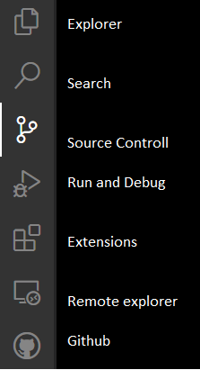
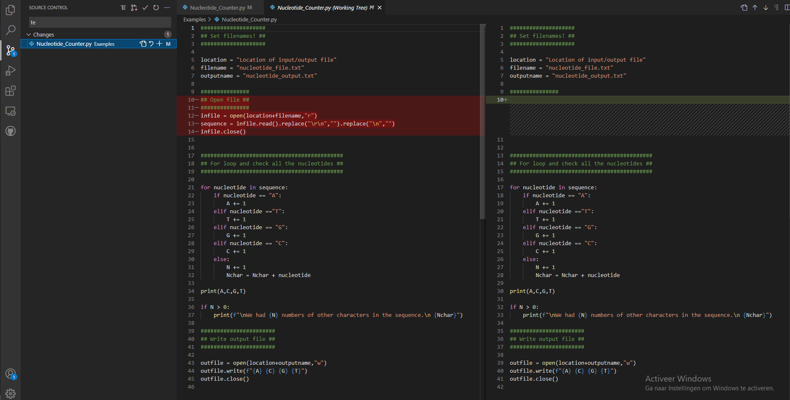
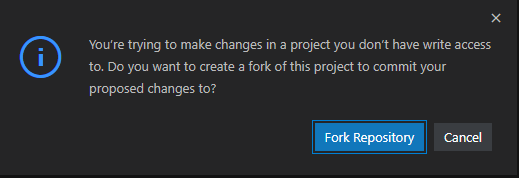
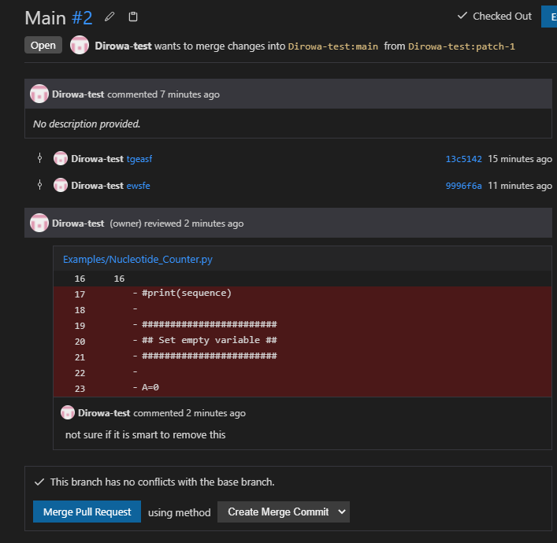

# Welcome to part 3 of the tutorial

<br>
Everybody likes some quality of life to make work a little better. <br>For working with Github alot, the internet webpage is not optimal.<br> Luckily are there various tools to help us, one of these tools is Visual Code Studio (VCS).
<br><br>
VCS is a source-code editor made by Microsoft and can run on Windos, Linux and macOS. It features debugging, syntax highlighting, snippets, code fractoring and is even embedded in git. <br>Thereby are there alot of extensions available online to customise VCS to your needs.<br> In this tutorial the installation to creating and using git will be explained.<br> It is also possible to run various commands in the terminal or even python scripts.<br><br>

# Contents

- Installation
- Extensions
- Overview of Visual Code studio
- Accesing a github
- Making branches and adjust codes
- Pull requests
- Reviewing
- Final note & Whats next

<br><br>

## Installation

Like the most programs, it can be easily installed by using the internet.<br> click [here](https://code.visualstudio.com/) for a link to download VCS. <br>
Complete the installation by using default settings.


<br><br><br>


## Extensions

Before we start the whole tutorial lets hook you up with some upgrades, lets install a few extensions.<br>
Extensions are little software packages who can install new features of make some quality of life changes.<br>

This can be an Interprentor for a piece of code (R, C++, python, Java), a proofreader for spelling mistakes or an extension who makes markdown easier for you. <br>
 It is worth it, to look online which are avaialble and suit your needs.<br>

Search for the following extensions by clicking on the extension button in the left bar. 
- Github Pull Requests and Issues.
- Github Repositories.
- Python.


<br>
<br>

## Overview of VCS

VCS contains alot of awesome features but can be quite overwhelming in the start.<br> Luckly we already installed some extensions for quality of life.<br>
The following gives a small overview of all functions of the tabs in VCS.<br>


- Explorer: In this  tab are all files of the current github repository.<br> This is currently still empty, but not for long! <br>
- Search: A search function for in your github repository.<br>
- Source controll: If you edited and saved a file from a github, is here your change to make an pull request or to commit it directly.<br>
- Run and debug: Is for running files, for example "hello_world.py".<br>
- Extensions: A place where you can go shopping for new plugins.<br>
- Remote exporer: An overview of previous githubs where you have been.<br>
- Github: Here is the real magic.<br> Every github repository you own or are admin for will notification be sended to this tab.<br> when a person makes a pull request, issue, review etc.<br> You will get an automated message here.<br> With this you can easily keep an eye on all your (team)projects.<br>



On the top bar of VCS are various tabs which can be quite usefull.<br>
It's also possible to open a terminal and run various codes. <br>

On the bottom of the window is the workspace and branch you are working in. <br>


<b> But enough talking, lets get into some action!<br><br><br> </b>


<br>

# login with Github

Since we want to work with gubhub, one of the items where Visual code studio in shines, we have to tell them who we are. <br>

make sure you have a Github account and are logged in the website of github  ```https://github.com/ ```

- click on the github icon. 
- click on Sign in


Following a popup should appear asking for authorisation.
- click on authorize github


Continue and authorize Github

In case you are not logged in, follow the direction of the website.
<br><br><br>
# forking & editing a file

More often do you think items can be better from an already existing code.<br>
With Forking, are you copying someone directory to make changes and safe it as your own.

there are easier ways to do so. 
for example by this [tutorial](https://doc.fireflymigration.com/working-with-github-fork-in-visual-studio.html), but we follow the tutorial beneath.


open the atgm github tutorial pages you are reading right now in VCS by doing the following:<br>
- click on the green button 
- on the top of your screen should a window pop up with multiple choises.
- click on ``` open github repository ```

- fill in the url of the github repository, ``` https://github.com/Avans-ATGM/Github_Tutorial ```

You have now locally openend a github public repository in VCS.  now lets change some files and make a fork by doing the following steps.

Go click on examples and then nucleotide_counter.py


when you clicked on this file a window should pop up.
In this is it possible to edit files so lets start and make a small edit
- make a small edit
- safe the file by ctrl-s or click on file and then safe
- go to source controll 

 

- if you click on your edited file you see what all is changed.



- click on commit with the upper button 

Since we dont have any right to this github repository, it will ask us to make an fork request instead


- click on fork repository 
- VCS studio is now asking for a branch name.

a branch is a different version then the main. so you can keep the original in cases that you have made errors.
- it will ask to switch to the fork and click on ``` switch to fork ```


Github will ask for a new branch name which you have to fill in and press enter


Now do you have a forked github repo in your own github account.
In this are you allowed to make all sorts of changes to your own liking.

since you didnt own the github repository previously, you will have to safe the file again.
- safe the file
- commit the file by source controll and give it a proper name followed by the commit button 


# pulling & reviewing

a pull request is the act of merging a branch into the main branch.
You can only do this when you are an admin of a github repository which you are always of your own reposiotry.
lets make a pull request of our created branch of the forked github repository.

- Click on create pull request under source controll  
- this should give a new window where you have to give some information


- edit the tab accordingly
- scroll a little bit down and click on 

When working alone it does not seem that much interesting but it can be quite handy when working with different versions or adding new features. with this you can for example first fully test all your scripts before merging it to the main branch.

When not working alone can other admins or owners of a github repository can see what you have changed and review your edits before accepting it & merging it into the main branch.<br>

In this case are you going to review your own changes, just to see the possibilities.

- click on the files in the tab Github pull request 
- click on your active pull request.
- in this you you have various actions to review the pull request.
- When you click on Merge pull request, the branch will be merged into the main branch.

It is also possible to review and give comments.


- click on the files and then examples
- click on nucleotide_counter.py
- see the changes which has occourd
- hover with the mouse over the white strip to give out a comment.


- other admins can read all the comments, even in VCS and keep the conversation going 
- it is also possible to make suggestions of changes

In the total pull request review will all comments be noted down



- click on merge pull request if you are happy with it.
- remove the branch since we dont need it anymore. 


 you still have to switch from branch. it doesnt exist anymore but it is still here

 To switch from branch:
 - click on the blue ``` Test_delete_later``` button
 - a pop up window above should appear
 - click on the main branch


<br><br>
<br>
<br>
<br>
<br>


## Final note & Whats next

So incase you are not convinced yet to work with github, here are a few reasons why:
- Always have a backup of your code.
- You can always revert changes incase it doesn't work out.
- It is easier to see what changes when working with collaborators.
- Multiple cool advanced options, for example to test the code when you created a commit.
- Overview of issues and a task managers.

### future reading

In case you really do like Visual code Studio, you can also run python or other coding languages in it.
click [here](https://code.visualstudio.com/docs/languages/python) for more information. 


